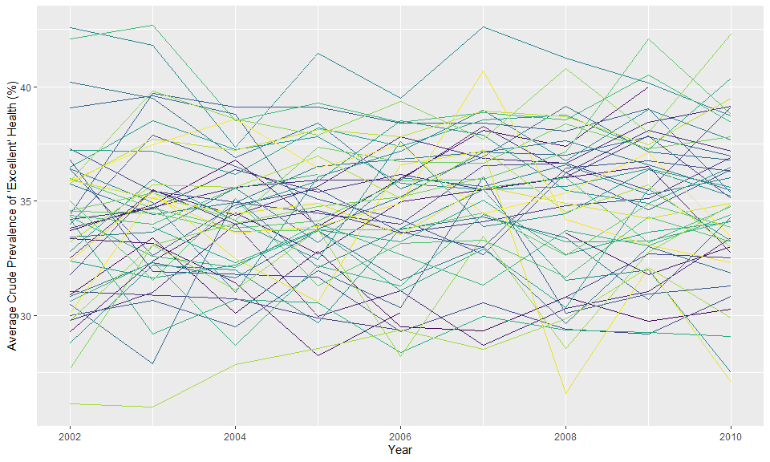

p8105\_hw3\_jsg2145
================
Jared Garfinkel
10/9/2019

``` r
library(p8105.datasets)
data("instacart")
data("brfss_smart2010")
```

The “instacart” dataset is 1384617 rows by 15 columns.

There are a few variables that appear to be key to telling us what the
dataset is.

The variable “product\_name” is an item that was placed in a cart. Order
have an “order\_id” number.

Each item in a cart has an “add\_to\_cart\_order”, for instance, in the
head of the data, “order\_id” 1

had 8 items added, 1 through 8 and “add\_to\_cart\_order” gives the
order in which the

items were added. There are columns that tell the time of day of the
order, the days

since the prior order, and whether a specific item was reordered or not.
There are

also details about where the item is found (aisle, department)

``` r
aisle_dat <- instacart %>% 
  group_by(aisle) %>%
  summarize(
    count = n()) %>% 
  arrange(desc(count))
```

## Problem 1

There are 134 aisles, and fresh vegetables was the aisle the most items
were ordered from.

``` r
instacart %>% 
  group_by(aisle) %>% 
  count() %>% 
  filter(
    n > 10000
  ) %>% 
  ggplot(aes(x = aisle, y = n)) +
  geom_col() +
  labs(xlab = "Count",
       ylab = "Aisle")
```

<!-- -->

``` r
instacart %>% 
  filter(
    aisle == c("baking ingredients", 
               "dog food care", 
               "packaged vegetables fruits")
    ) %>% 
  mutate(
    aisle = 
      recode(aisle,
             "baking ingredients" = "Baking Ingredients",
             "dog food care" = "Dog Food Care",
             "packaged vegetables fruits" = "Packaged Vegetables Fruits")) %>% 
  group_by(aisle, product_name) %>% 
  summarize(
    count =  n()
  ) %>% 
  top_n(., 3, count) %>% 
  arrange(desc(count), .by_group = TRUE) %>% 
  rename(Aisle = aisle,
         "Product Name" = product_name,
         Count = count) %>% 
  knitr::kable()
```

| Aisle                      | Product Name                                    | Count |
| :------------------------- | :---------------------------------------------- | ----: |
| Baking Ingredients         | Light Brown Sugar                               |   157 |
| Baking Ingredients         | Pure Baking Soda                                |   140 |
| Baking Ingredients         | Organic Vanilla Extract                         |   122 |
| Dog Food Care              | Organix Grain Free Chicken & Vegetable Dog Food |    14 |
| Dog Food Care              | Organix Chicken & Brown Rice Recipe             |    13 |
| Dog Food Care              | Original Dry Dog                                |     9 |
| Packaged Vegetables Fruits | Organic Baby Spinach                            |  3324 |
| Packaged Vegetables Fruits | Organic Raspberries                             |  1920 |
| Packaged Vegetables Fruits | Organic Blueberries                             |  1692 |

``` r
instacart %>% 
  filter(product_name == c("Pink Lady Apples", "Coffee Ice Cream")) %>% 
  group_by(product_name, order_dow) %>% 
  summarize(
    mean_hr = round(mean(order_hour_of_day), digits = 1)
  ) %>% 
  mutate(
    order_dow = factor(order_dow, 
                       labels = c("Sunday", "Monday", "Tuesday", "Wednesday", "Thursday", "Friday", "Saturday"))) %>%
  rename("Product Name" = product_name) %>% 
  pivot_wider(
    names_from = order_dow,
    values_from = mean_hr
  ) %>% 
  knitr::kable()
```

    ## Warning in product_name == c("Pink Lady Apples", "Coffee Ice Cream"):
    ## longer object length is not a multiple of shorter object length

| Product Name     | Sunday | Monday | Tuesday | Wednesday | Thursday | Friday | Saturday |
| :--------------- | -----: | -----: | ------: | --------: | -------: | -----: | -------: |
| Coffee Ice Cream |   13.2 |   15.0 |    15.3 |      15.4 |     15.2 |   10.3 |     12.4 |
| Pink Lady Apples |   12.2 |   11.7 |    12.0 |      13.9 |     11.9 |   13.9 |     11.6 |

## Problem 2

``` r
brfss_smart2010 <- brfss_smart2010 %>% 
  janitor::clean_names() %>% 
  filter(topic == "Overall Health") %>%
  mutate(
    response = factor(response, 
                      labels  = c("Poor", "Fair", "Good", "Very good", "Excellent")),
    state = match(locationabbr, state.abb),
    state = state.name[state],
    state = replace_na(state, "District of Columbia")
  ) %>% 
  arrange(response)
```

``` r
brfss_smart2010 %>% 
  filter(year == 2002) %>% 
  select(state) %>% 
  group_by(state) %>% 
  count() %>% 
  filter(n > 6) %>% 
  rename(State = state,
         Locations = n) %>% 
  knitr::kable()
```

| State          | Locations |
| :------------- | --------: |
| Arizona        |        10 |
| Colorado       |        20 |
| Connecticut    |        35 |
| Delaware       |        15 |
| Florida        |        35 |
| Georgia        |        15 |
| Hawaii         |        20 |
| Idaho          |        10 |
| Illinois       |        15 |
| Indiana        |        10 |
| Kansas         |        15 |
| Louisiana      |        15 |
| Maine          |        10 |
| Maryland       |        30 |
| Massachusetts  |        40 |
| Michigan       |        20 |
| Minnesota      |        20 |
| Missouri       |        10 |
| Nebraska       |        15 |
| Nevada         |        10 |
| New Hampshire  |        25 |
| New Jersey     |        40 |
| New York       |        25 |
| North Carolina |        35 |
| Ohio           |        20 |
| Oklahoma       |        15 |
| Oregon         |        15 |
| Pennsylvania   |        50 |
| Rhode Island   |        20 |
| South Carolina |        15 |
| South Dakota   |        10 |
| Tennessee      |        10 |
| Texas          |        10 |
| Utah           |        25 |
| Vermont        |        15 |
| Washington     |        20 |

``` r
brfss_smart2010 %>% 
  filter(year == 2010) %>% 
  select(state, locationdesc) %>% 
  group_by(state) %>% 
  count() %>% 
  filter(n > 6) %>% 
  rename(State = state,
         Locations = n) %>% 
  knitr::kable()
```

| State          | Locations |
| :------------- | --------: |
| Alabama        |        15 |
| Arizona        |        15 |
| Arkansas       |        15 |
| California     |        60 |
| Colorado       |        35 |
| Connecticut    |        25 |
| Delaware       |        15 |
| Florida        |       205 |
| Georgia        |        20 |
| Hawaii         |        20 |
| Idaho          |        30 |
| Illinois       |        10 |
| Indiana        |        15 |
| Iowa           |        10 |
| Kansas         |        20 |
| Louisiana      |        25 |
| Maine          |        30 |
| Maryland       |        60 |
| Massachusetts  |        45 |
| Michigan       |        20 |
| Minnesota      |        25 |
| Mississippi    |        10 |
| Missouri       |        15 |
| Montana        |        15 |
| Nebraska       |        50 |
| Nevada         |        10 |
| New Hampshire  |        25 |
| New Jersey     |        95 |
| New Mexico     |        30 |
| New York       |        45 |
| North Carolina |        60 |
| North Dakota   |        15 |
| Ohio           |        40 |
| Oklahoma       |        15 |
| Oregon         |        20 |
| Pennsylvania   |        35 |
| Rhode Island   |        25 |
| South Carolina |        35 |
| South Dakota   |        10 |
| Tennessee      |        25 |
| Texas          |        80 |
| Utah           |        30 |
| Vermont        |        30 |
| Washington     |        50 |
| Wyoming        |        10 |

``` r
df <- brfss_smart2010 %>% 
  filter(response == "Excellent") %>% 
  group_by(year, state) %>% 
  summarize(
    mean_dat = mean(data_value)
  ) %>% 
  select(year, state, mean_dat)
```

``` r
df %>% 
  ggplot(aes(x = year, y = mean_dat, group = state, color = state)) +
  geom_line() +
  theme(legend.position = "bottom") +
  viridis::scale_color_viridis(
    name = "state",
    discrete = TRUE)
```

    ## Warning: Removed 2 rows containing missing values (geom_path).

<!-- -->

``` r
brfss_smart2010 %>% 
  filter(state == "New York",
         year == c(2006, 2010)) %>% 
  ggplot(aes(x = response, y = data_value)) +
  geom_boxplot() +
  labs(x = "Response",
       y = "Data Value") +
  facet_grid(~year)
```

    ## Warning in year == c(2006, 2010): longer object length is not a multiple of
    ## shorter object length

<!-- -->

## Problem 3
