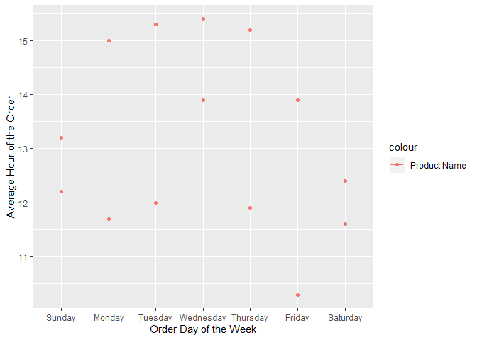

p8105\_hw3\_jsg2145
================
Jared Garfinkel
10/9/2019

``` r
library(p8105.datasets)
data("instacart")
data("brfss_smart2010")
```

## Problem 1

The “instacart” dataset is 1384617 rows by 15 columns.

There are a few variables that appear to be key to telling us what the
dataset is.

The variable “product\_name” is an item that was placed in a cart.
Orders have an “order\_id” number.

Each item in a cart has an “add\_to\_cart\_order”, for instance, in the
head of the data, “order\_id” = 1

had 8 items added, numbered 1 through 8, and “add\_to\_cart\_order”
gives the order in which the

items were added. There are columns that tell the time of day of the
order, the days

since the prior order, and whether a specific item had been reordered or
not. There are

also details about where the item is found (aisle, department)

``` r
aisle_dat <- instacart %>% 
  group_by(aisle) %>%
  summarize(
    count = n()) %>% 
  arrange(desc(count))
```

There are 134 aisles, and “fresh vegetables” was the aisle the most
items were ordered from.

Fresh fruit and vegetables are the top two aisles from which items were
ordered by a significant margin,

with packaged fruit and vegetables coming in a distant third.

``` r
instacart %>% 
  group_by(aisle) %>% 
  count() %>% 
  filter(
    n > 10000
  ) %>% 
  ggplot(aes(x = reorder(aisle, n), y = n)) +
  geom_col() +
  labs(x = "Aisle",
       y = "Count") +
  theme(axis.text.x = element_text(angle = 45, vjust = 1, hjust=1))
```

<!-- -->

This plot shows the top 39 most ordered from aisles. This represents the
top 29.1044776 percent

of aisles ordered from over the time period of the data.

``` r
instacart %>% 
  filter(
    aisle == c("baking ingredients", 
               "dog food care", 
               "packaged vegetables fruits")
    ) %>% 
  mutate(
    aisle = 
      recode(aisle,
             "baking ingredients" = "Baking Ingredients",
             "dog food care" = "Dog Food Care",
             "packaged vegetables fruits" = "Packaged Vegetables Fruits")) %>% 
  group_by(aisle, product_name) %>% 
  summarize(
    count =  n()
  ) %>% 
  top_n(., 3, count) %>% 
  arrange(desc(count), .by_group = TRUE) %>% 
  rename(Aisle = aisle,
         "Product Name" = product_name,
         Count = count) %>% 
  knitr::kable()
```

| Aisle                      | Product Name                                    | Count |
| :------------------------- | :---------------------------------------------- | ----: |
| Baking Ingredients         | Light Brown Sugar                               |   157 |
| Baking Ingredients         | Pure Baking Soda                                |   140 |
| Baking Ingredients         | Organic Vanilla Extract                         |   122 |
| Dog Food Care              | Organix Grain Free Chicken & Vegetable Dog Food |    14 |
| Dog Food Care              | Organix Chicken & Brown Rice Recipe             |    13 |
| Dog Food Care              | Original Dry Dog                                |     9 |
| Packaged Vegetables Fruits | Organic Baby Spinach                            |  3324 |
| Packaged Vegetables Fruits | Organic Raspberries                             |  1920 |
| Packaged Vegetables Fruits | Organic Blueberries                             |  1692 |

This table shows the top three items ordered from the aisles “baking
ingredients”,

“dog food care”, and “packaged vegetables fruits” in the time period of
the data. There is a wide range in the

number of times each item was ordered. Dog food may not be something
many people think to have

delivered from a grocery store.

``` r
instacart %>% 
  filter(product_name == c("Pink Lady Apples", "Coffee Ice Cream")) %>% 
  group_by(product_name, order_dow) %>% 
  summarize(
    mean_hr = round(mean(order_hour_of_day), digits = 1)
  ) %>% 
  mutate(
    order_dow = factor(order_dow, 
                       labels = c("Sunday", "Monday", "Tuesday", "Wednesday", "Thursday", "Friday", "Saturday"))) %>%
  rename("Product Name" = product_name) %>% 
  pivot_wider(
    names_from = order_dow,
    values_from = mean_hr
  ) %>% 
  knitr::kable()
```

    ## Warning in product_name == c("Pink Lady Apples", "Coffee Ice Cream"):
    ## longer object length is not a multiple of shorter object length

| Product Name     | Sunday | Monday | Tuesday | Wednesday | Thursday | Friday | Saturday |
| :--------------- | -----: | -----: | ------: | --------: | -------: | -----: | -------: |
| Coffee Ice Cream |   13.2 |   15.0 |    15.3 |      15.4 |     15.2 |   10.3 |     12.4 |
| Pink Lady Apples |   12.2 |   11.7 |    12.0 |      13.9 |     11.9 |   13.9 |     11.6 |

``` r
instacart %>% 
  filter(product_name == c("Pink Lady Apples", "Coffee Ice Cream")) %>% 
  group_by(product_name, order_dow) %>% 
  summarize(
    mean_hr = round(mean(order_hour_of_day), digits = 1)
  ) %>% 
  mutate(
    order_dow = factor(order_dow, 
                       labels = c("Sunday", "Monday", "Tuesday", "Wednesday", "Thursday", "Friday", "Saturday"))) %>%
  ggplot(aes(x = order_dow, y = mean_hr, color = product_name)) +
  geom_point() + 
  geom_smooth(se = FALSE)
```

    ## Warning in product_name == c("Pink Lady Apples", "Coffee Ice Cream"):
    ## longer object length is not a multiple of shorter object length

    ## `geom_smooth()` using method = 'loess' and formula 'y ~ x'

<!-- -->

This table shows the time of day these items were ordered. It appears
Coffee Ice Cream was

ordered later in the day most days except for Fridays for some reason.

## Problem 2

``` r
brfss_smart2010 <- brfss_smart2010 %>% 
  janitor::clean_names() %>% 
  filter(topic == "Overall Health") %>%
  mutate(
    response = factor(response, 
                      labels  = c("Poor", "Fair", "Good", "Very good", "Excellent")),
    state = match(locationabbr, state.abb),
    state = state.name[state],
    state = replace_na(state, "District of Columbia")
  ) %>% 
  arrange(response)
```

``` r
many_loc_02 <- brfss_smart2010 %>% 
  filter(year == 2002) %>% 
  select(state) %>% 
  group_by(state) %>% 
  count() %>% 
  filter(n > 6) %>% 
  rename(State = state,
         Locations = n) %>% 
  knitr::kable()
```

There are states with 7 or more locations included in the BRFSS data in
2002.

``` r
many_loc_10 <- brfss_smart2010 %>% 
  filter(year == 2010) %>% 
  select(state, locationdesc) %>% 
  group_by(state) %>% 
  count() %>% 
  filter(n > 6) %>% 
  rename(State = state,
         Locations = n) %>% 
  knitr::kable()
```

By 2010, there were states with 7 or more locations included in the
data.

``` r
df <- brfss_smart2010 %>% 
  filter(response == "Excellent") %>% 
  group_by(year, state) %>% 
  summarize(
    mean_dat = mean(data_value)
  ) %>% 
  select(year, state, mean_dat)
```

``` r
df %>% 
  ggplot(aes(x = year, y = mean_dat, group = state, color = state)) +
  geom_line() +
  theme(legend.position = "none") +
  viridis::scale_color_viridis(
    name = "state",
    discrete = TRUE) +
  labs(
    x = "Year",
    y = "Average Crude Prevalence of 'Excellent' Health (%)"
  )
```

    ## Warning: Removed 2 rows containing missing values (geom_path).

<!-- -->

This chart shows the crude prevalence of a response of “excellent” to
the question “How is your general health?”

``` r
brfss_smart2010 %>% 
  filter(state == "New York",
         year %in% c(2006, 2010)) %>% 
  ggplot(aes(x = response, y = data_value)) +
  geom_boxplot() +
  labs(x = "Response",
       y = "Data Value") +
  facet_grid(~year)
```

<!-- -->

## Problem 3

``` r
accel_dat <- read_csv("./data/accel_data.csv") %>% 
  pivot_longer(
    cols = activity.1:activity.1440,
    names_to = "minute",
    values_to = "activity") %>% 
  group_by(day) %>% 
  mutate(
    weekday = ifelse(day %in% c("Monday", "Tuesday", "Wednesday", "Thursday", "Friday"), "Weekday", "Weekend")
  )
```

    ## Parsed with column specification:
    ## cols(
    ##   .default = col_double(),
    ##   day = col_character()
    ## )

    ## See spec(...) for full column specifications.

There are 50400 rows and 6 columns in this dataset. There is a minute

variable for each minute of a day, a weekday variable for whether the
day of the week is a weekend or

a weekday, a week variable for each of the five weeks of observations,
and a variable, “day\_id” for

each day in the study. The final variable measures the activity of the
subject at each interval.

    ## `geom_smooth()` using method = 'loess' and formula 'y ~ x'

<!-- -->

``` r
accel_dat %>% 
  aggregate(activity ~ day_id, data = ., sum) %>% 
  knitr::kable()
```

| day\_id |  activity |
| ------: | --------: |
|       1 | 480542.62 |
|       2 |  78828.07 |
|       3 | 376254.00 |
|       4 | 631105.00 |
|       5 | 355923.64 |
|       6 | 307094.24 |
|       7 | 340115.01 |
|       8 | 568839.00 |
|       9 | 295431.00 |
|      10 | 607175.00 |
|      11 | 422018.00 |
|      12 | 474048.00 |
|      13 | 423245.00 |
|      14 | 440962.00 |
|      15 | 467420.00 |
|      16 | 685910.00 |
|      17 | 382928.00 |
|      18 | 467052.00 |
|      19 | 371230.00 |
|      20 | 381507.00 |
|      21 | 468869.00 |
|      22 | 154049.00 |
|      23 | 409450.00 |
|      24 |   1440.00 |
|      25 | 260617.00 |
|      26 | 340291.00 |
|      27 | 319568.00 |
|      28 | 434460.00 |
|      29 | 620860.00 |
|      30 | 389080.00 |
|      31 |   1440.00 |
|      32 | 138421.00 |
|      33 | 549658.00 |
|      34 | 367824.00 |
|      35 | 445366.00 |

``` r
accel_dat %>% 
  group_by(day_id, day) %>%
  mutate(
    day_act = cumsum(activity)
  ) %>% 
  summarize(
    day_act = last(day_act)
  ) %>% 
  rename(Day = day) %>% 
  ggplot(aes(x = day_id, y = day_act, color = Day)) +
  geom_point() + 
  labs(
    x = "Day of Study (1-35)",
    y = "Total Activity"
  ) +
  theme(legend.position = "bottom") +
  scale_x_discrete(limits = 0:36)
```

<!-- -->

``` r
accel_dat %>% 
  select(weekday, day_id, day)
```

    ## # A tibble: 50,400 x 3
    ## # Groups:   day [7]
    ##    weekday day_id day   
    ##    <chr>    <dbl> <chr> 
    ##  1 Weekday      1 Friday
    ##  2 Weekday      1 Friday
    ##  3 Weekday      1 Friday
    ##  4 Weekday      1 Friday
    ##  5 Weekday      1 Friday
    ##  6 Weekday      1 Friday
    ##  7 Weekday      1 Friday
    ##  8 Weekday      1 Friday
    ##  9 Weekday      1 Friday
    ## 10 Weekday      1 Friday
    ## # ... with 50,390 more rows
